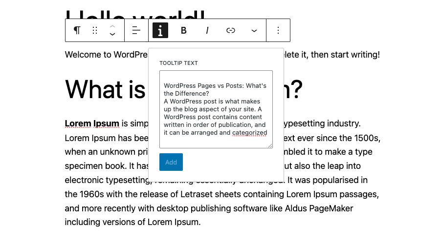
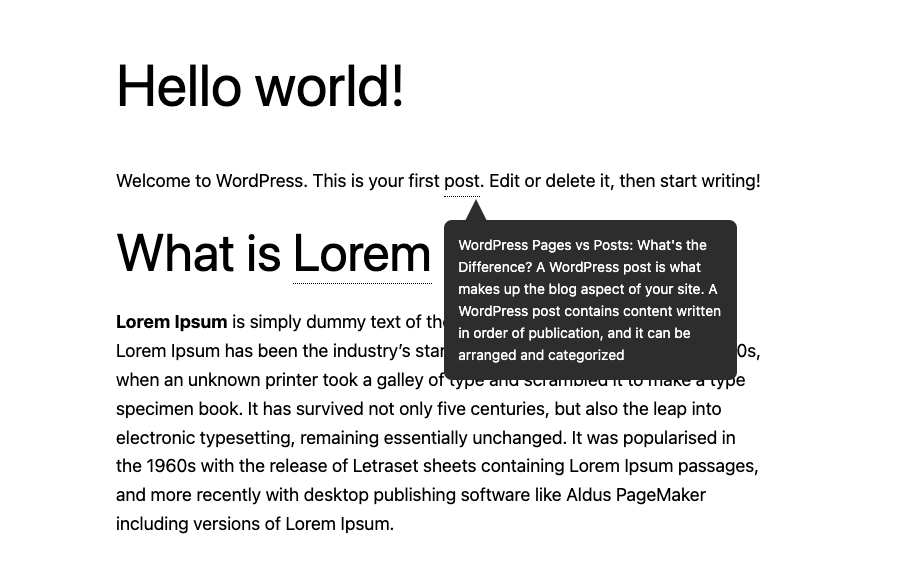
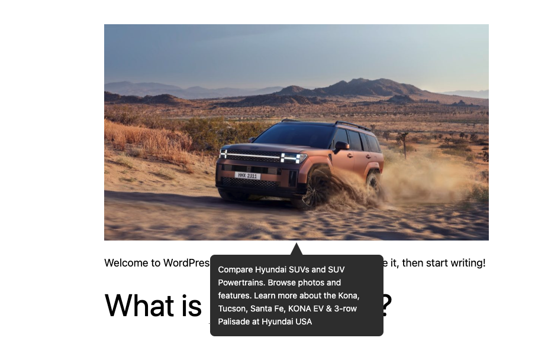

# Guten Tooltip
Add Tooltip to Gutenberg RichText and Blocks
## Scripts

- Run `npm i` from `assets` folder to install required npm packages.
- Run `npm run dev` for development
- Run `npm run build` for production.
- Run `npm run bundle` for exporting plugin zip file in the './dist'.

## Screenshots

### Editor

### Frontend
#### Richtext

#### core/image block

